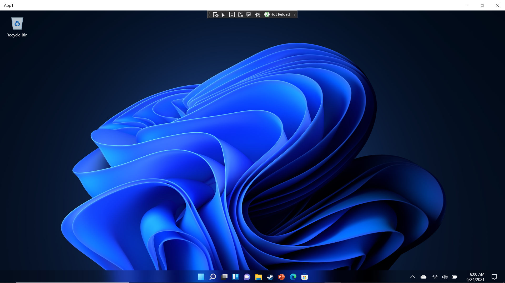
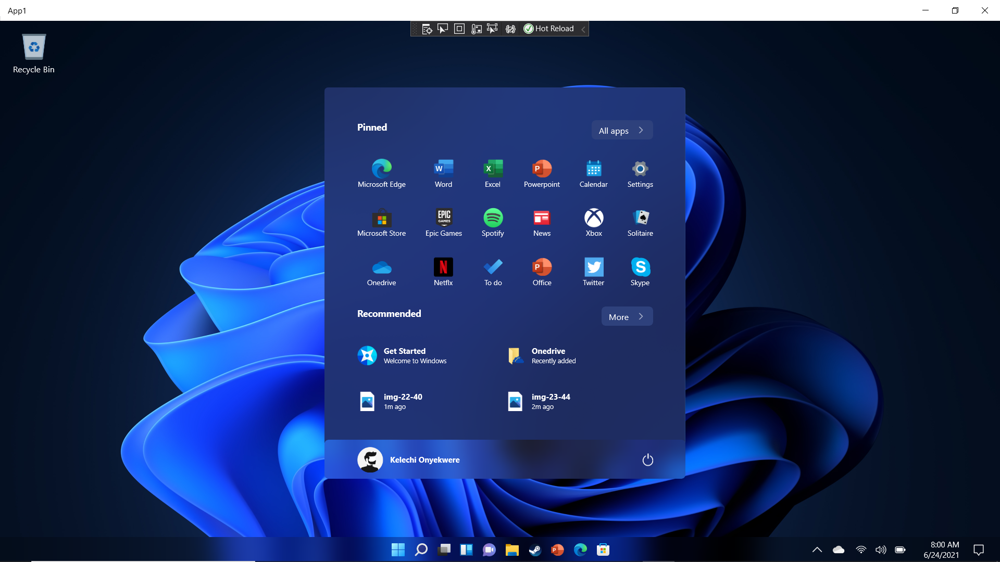
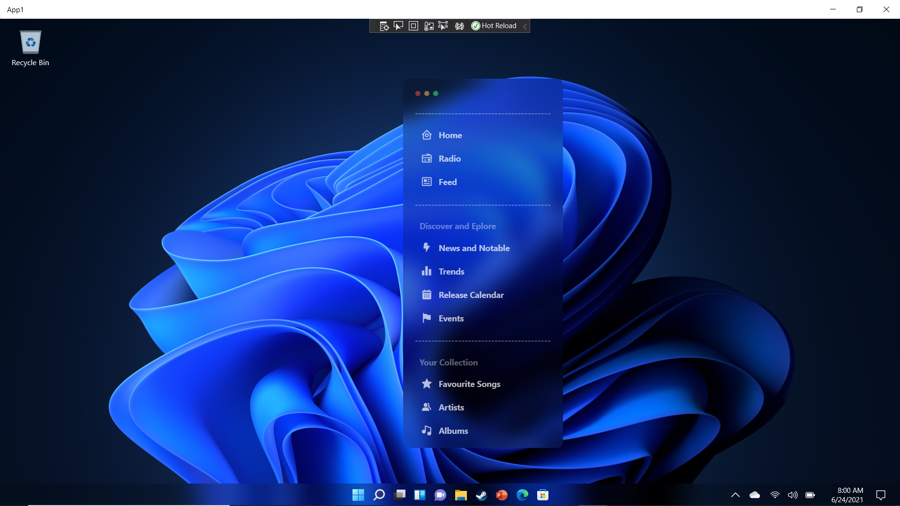

# Windows11-UWP

### A Microsoft UWP design of the Windows 11 OS

#### GlassMorphism design was achieved using *AcrylicBrush*

```xaml
 <media:AcrylicBrush
    BackgroundSource="Backdrop"
    TintColor="Black"
    TintOpacity="0.2"
    BlurAmount="20"/>
 ```
 
 
 
  
  
   
